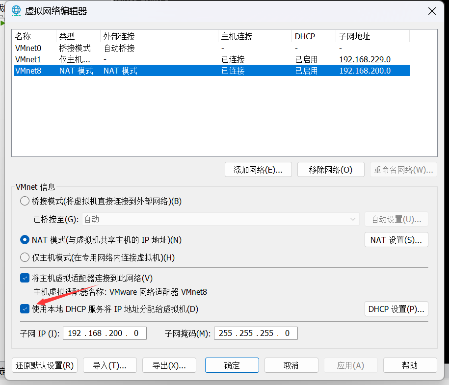
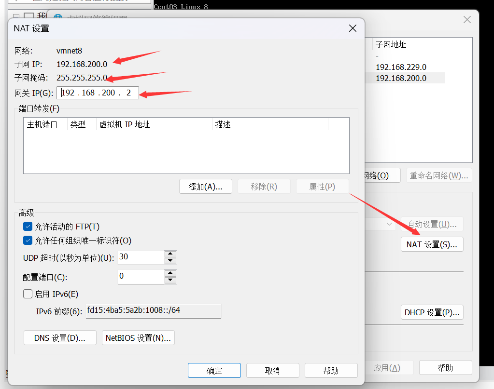

# CyberCS 项目文档

整体采用微服务架构，整合知识帖子、OJ、API开放平台、聚合搜索的综合计算机知识平台

## 一、

2023 - 11 - 01 

### 1. 后端项目初始化

- 搭建centos8虚拟机环境

  踩坑：



不勾选的话，在安装CentOS8的时候，虚拟机不会被分配 IP 地址，获取不到网络。

**设置静态IP**



编辑文件 /etc/sysconfig/network-scripts/ifcfg-ens160 

``` 
BOOTPROTO=static
IPADDR=192.168.200.200    # ip地址 前三个网段跟宿主机保持一致,第四个不要跟宿主机IP相同
GATEWAY=192.168.200.2   # 网关 跟宿主机一样
NETMASK=255.255.255.0 # 子网掩码 一般都是这个
DNS1=8.8.8.8 # 8.8.8.8为Google提供的免费DNS服务器的IP地址
DNS2=8.8.4.4 # 8.8.4.4为Google提供的免费DNS服务器的IP地址
DNS3=114.114.114.114    # DNS地址,网上有的教程说可以不写,但是我的不写不行,也不用变,直接写这个
```

## 二、

2023 - 11 - 04

### 1. 用 docker 在虚拟机上安装 Redis 和 MySQL

- 安装 docker

- 镜像加速下载

  https://cr.console.aliyun.com/cn-hangzhou/instances/mirrors

- docker 安装 Redis

  https://blog.csdn.net/weixin_45821811/article/details/116211724

- docker 安装 MySQL 并开启远程访问 （端口为3348）

  https://blog.csdn.net/qq_35167373/article/details/128815794

### 2. 以用户模块（cybercs-user）为初始模块搭建后端微服务架构

1. 新建 maven 父工程

   - 编辑 pom 文件：

     ``` xml
     <!--聚合工程（父工程）-->
     <packaging>pom</packaging>
     
     <!--子模块-->
     <modules>
     
     </modules>
     
     ```

2. 创建子模块 cybercs-common （公共模块）

   - 将 springboot-init-template 中的依赖包全部复制到 common 模块中

     其中测试相关的包好像必须直接依赖

     ```xml
     <dependency>
         <groupId>org.springframework.boot</groupId>
         <artifactId>spring-boot-starter-test</artifactId>
         <scope>test</scope>
     </dependency>
     ```

   - 将 springboot-init-template 中的 common、constant、config  包复制到 cybercs-common 中

3. 创建用户管理模块 cybercs-user

   - 建用户表
   

## 三、

2023 - 11 - 05

### 1. 初始化第一个业务模块 cybercs-user 用户管理模块

- 配置 Redis

  直接使用 StringRedisTemplate 之后再去封装使用的工具类

- 整合参数校验框架

  https://developer.aliyun.com/article/1299428

- 增删改查：注册、登录等等

  **将实体类抽离到 cybercs-model 模块中**

  **!!! 测试时发现 common 模块中的全局异常处理器没发挥作用**

  需要在模块启动类上加上扫描包的注解

  ```java 
  @SpringBootApplication(scanBasePackages = "com.zpp.cybercs")
  ```

  同时保证接口文档正常

  ``` java 
  // 指定 Controller 扫描包路径
  .apis(RequestHandlerSelectors.basePackage("com.zpp.cybercs"))
  ```

## 四、

2023 - 11 - 06

### 1.  使用 Redis + token 实现单点登录

- 封装 StringRedisTemplate 工具类，提取方法

  - 将对象转化为 hash 存储


  - 在测试的时候发现，在 UserServiceImpl 中注入 StringRedisTemplate 变量名必须是 stringRedisTemplate 否则报错，

    本质因为 @Resource是默认取字段名进行按照名称注入

## 五、 

2023 - 11 -09 

### 1. 自定义注解，通过 Spring AOP 实现身份校验，接口响应日志

https://blog.csdn.net/baidu_28340727/article/details/128319277

（注：实际开发中发现将实体类抽象出一个模块非常麻烦，先直接聚合到独立模块里，之后再优化）

### 2.  使用 Spring Gateway 作拦截器、token 刷新、处理跨域

https://spring.io/projects/spring-cloud-gateway#support


